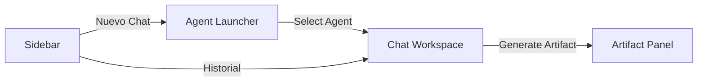

# Resumen Frontend - Proyecto SPHERE

**Interfaz Ultra-Premium con "Midnight Protocol" y Artifacts Workspace**

---

## 🗓️ Cronología del Trabajo

### **28 - 29 enero, 2026 - Cimientos y HUD Visual**

#### Hitos
- ✅ **Midnight Protocol Design System**: Definición de paleta de colores (Cyan Eléctrico, Luxury Purple, Midnight).
- ✅ **HUD Effects**: Animaciones Aurora, Blobs vivos y efectos de cristal (glassmorphism).
- ✅ **Streaming UI**: Implementación de lógica para recibir y renderizar tokens en tiempo real con efecto "tipeado".
- ✅ **Personalización de Agentes**: Sistema de cambio de nombre y color individual (pickers personalizados).

---

---

### **31 enero, 2026 - Agent Launcher & Multisesión (Hito de Escalabilidad)**

#### Hitos

##### 1. **Revolución UI: Agent Launcher**
- ✅ **Acción Unificada**: Sustitución de listas estáticas por un botón global "Nuevo Chat" con HUD animado.
- ✅ **AgentSelectorModal**: Centro de mando para elegir entre el **Core Board** y **Expertos Personalizados**.
- ✅ **HUD Táctico**: Efectos de iluminación HUD para el agente seleccionado y búsqueda ultra-rápida.

##### 2. **Gestión de Expertos (Custom Agents)**
- ✅ **Interface de Creación**: Formulario premium para definir nombre, rol y **System Prompt** de nuevos agentes.
- ✅ **Ciclo de Vida**: Integración completa con el backend para crear y eliminar expertos desde la UI.

##### 3. **Estado Multisesión Concurrente**
- ✅ **Zustand Refactor**: Migración a un estado indexado por sesión (`messagesBySession`).
- ✅ **Multitasking Real**: Soporte para múltiples streamings de chat activos al mismo tiempo.
- ✅ **Activity Pulse**: Indicadores visuales en el historial que pulsan cuando una sesión recibe una respuesta en segundo plano.

---

## 📊 Estado Actual del Frontend

### Flujo de Navegación

### Tecnologías de Hoy
- **Sincronización**: React Router 6 para gestión de estados vía URL.
- **Iconografía**: Lucide-React (Nuevos iconos para expertos y guardado).
- **UX**: Portals para el Global Launcher Overlay.

---

## 🎯 Logros de Hoy
1. **Escalabilidad**: El sistema ya no está limitado a 4 agentes; ahora soporta un número infinito de expertos personalizados.
2. **Concurrencia**: UX fluida que permite saltar entre conversaciones activas sin perder el flujo de datos.
3. **Identidad**: El usuario ya no solo consume IA, la **diseña** y la organiza.

---

**Última actualización**: 31 de enero, 2026  
**Estado del proyecto**: ✅ Ecosistema UI Multi-Agente y Multisesión Completo.
