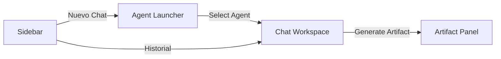

# Resumen Frontend - Proyecto SPHERE

**Interfaz Ultra-Premium con "Midnight Protocol" y Artifacts Workspace**

---

## 🗓️ Cronología del Trabajo

### **28 - 29 enero, 2026 - Cimientos y HUD Visual**

#### Hitos
- ✅ **Midnight Protocol Design System**: Definición de paleta de colores (Cyan Eléctrico, Luxury Purple, Midnight).
- ✅ **HUD Effects**: Animaciones Aurora, Blobs vivos y efectos de cristal (glassmorphism).
- ✅ **Streaming UI**: Implementación de lógica para recibir y renderizar tokens en tiempo real con efecto "tipeado".
- ✅ **Personalización de Agentes**: Sistema de cambio de nombre y color individual (pickers personalizados).

---

---

### **31 enero, 2026 - Agent Launcher & Multisesión (Hito de Escalabilidad)**

#### Hitos

##### 1. **Revolución UI: Agent Launcher**
- ✅ **Acción Unificada**: Sustitución de listas estáticas por un botón global "Nuevo Chat" con HUD animado.
- ✅ **AgentSelectorModal**: Centro de mando para elegir entre el **Core Board** y **Expertos Personalizados**.
- ✅ **HUD Táctico**: Efectos de iluminación HUD para el agente seleccionado y búsqueda ultra-rápida.

##### 2. **Gestión de Expertos (Custom Agents)**
- ✅ **Interface de Creación**: Formulario premium para definir nombre, rol y **System Prompt** de nuevos agentes.
- ✅ **Ciclo de Vida**: Integración completa con el backend para crear y eliminar expertos desde la UI.

##### 3. **Estado Multisesión Concurrente**
- ✅ **Zustand Refactor**: Migración a un estado indexado por sesión (`messagesBySession`).
- ✅ **Aislamiento por Agente**: Implementación de `sessionsByAgent` para garantizar que cada experto mantenga su propia sesión independiente sin solapamientos.
- ✅ **Optimización de Carga**: Refactor de `loadSession` con sistema de caché local; evita llamadas redundantes al backend si el historial ya reside en memoria.
- ✅ **Confiabilidad de API**: Ingesta de validación `response.ok` en `api.ts` para prevenir la creación de "sesiones fantasma" cuando el backend falla.
- ✅ **Multitasking Real**: Soporte para múltiples streamings de chat activos al mismo tiempo.
- ✅ **Activity Pulse**: Indicadores visuales en el historial que pulsan cuando una sesión recibe una respuesta en segundo plano.

### **01 - 02 febrero, 2026 - Documentación y Open Source (Estado de Producción)**

#### Hitos

##### 1. **Propiedad Intelectual y Transparencia**
- ✅ **Mapa de Arquitectura**: Análisis detallado de los 27 archivos del core frontend.
- ✅ **Documentación Técnica**: Descripción exhaustiva de hooks (`useChatStore`), servicios (`api.ts`) y componentes de artefactos.
- ✅ **Diagramas UML**: Documentación visual de los flujos de datos y jerarquía de componentes.

##### 3. **Limpieza de UI y QA de Stress (01 Febrero)**
- ✅ **Corrección de "Message Blobs"**: Ajuste de alineación y bordes en `MessageBubble.tsx` para evitar distorsiones en mensajes largos.
- ✅ **Fix de Hooks**: Resolución de violación de reglas de React Hooks en el renderizado de mensajes.
- ✅ **Sincronización de Header**: Corrección del bug donde el título del chat no se actualizaba al cambiar de sesión (Sincronización de `selectedAgentId`).
- ✅ **Caos en los Límites**: Ejecución de stress tests con ráfagas de mensajes y respuestas de gran volumen, validando la estabilidad del layout.

##### 4. **GitHub Deployment**
- ✅ **Repositorio Independiente**: Migración del código frontend a [Frontend_SPHERE](https://github.com/AndreSaul16/Frontend_SPHERE).
- ✅ **Saneamiento**: Configuración de `.gitignore` profesional para excluir dependencias y basura de compilación.

---

## 📊 Estado Actual del Frontend

### Flujo de Navegación

```mermaid
graph LR
    A[Sidebar] -->|Nuevo Chat| B[Agent Launcher]
    B -->|Select Agent| C[Chat Workspace]
    C -->|Generate Artifact| D[Artifact Panel]
    A -->|Historial| C
```

---

### **03 febrero, 2026 - Hotfix de Navegación y Flujo de Configuración**

#### Hitos
- ✅ **Redirección de Cabecera**: Implementada la navegación programática con `useNavigate` en `ChatPanel.tsx`.
- ✅ **Acceso a Ajustes**: Vinculado el Avatar y el menú `MoreVertical` del encabezado a la ruta `/chat/settings`, corrigiendo el comportamiento que abría el selector de agentes por error.
- ✅ **Integridad de Sidebar**: Verificado que la creación de nuevos chats desde la barra lateral mantiene la funcionalidad de `AgentSelectorModal` intacta.
- ✅ **Optimización de Código**: Eliminado el uso de variables del store (`toggleAgentModal`) innecesarias en el panel de chat tras el cambio de lógica.

### **10 febrero, 2026 - Sincronía con Esquema de Persistencia**

#### Hitos
- ✅ **Validación de Consumo de Metadatos**: Confirmación de que los campos `override_name` y `override_avatar` persistidos en `sessions_metadata` son consumidos correctamente por la UI.
- ✅ **Persistencia Visual**: Asegurada la coherencia estética (colores, nombres) entre recargas de página mediante el mapeo riguroso en `useChatStore`.

---

### **10 febrero, 2026 - Hotfix de Interactividad y Navegación (Tarde)**

#### Hitos
- ✅ **Sincronización Instantánea**: Refactor de `loadSession` para priorizar metadatos de sesión (`base_agent_id`) sobre la inferencia de mensajes, arreglando el bug de la cabecera estática al cambiar de chat.
- ✅ **Header Interactivo**: Implementación de `onClick` en Avatar y el botón de menú vertical en `ChatPanel.tsx` para acceso instantáneo a la configuración del experto.
- ✅ **Feedback Visual Premium**: Añadido estado `cursor-pointer` y efectos de hover sincronizados con el Midnight Protocol en los elementos de acción del header.

---

### **10 febrero, 2026 - Arquitectura WhatsApp Executive & Zustand Store (Noche)**

#### Hitos
- ✅ **Layout Shell (3 Columnas)**: Implementación de la estructura base con `MainLayout`, centralizando la navegación y el área de trabajo.
- ✅ **Reactive Brain (Zustand)**: Implementación de `useChatStore` para el manejo de mensajes, selección de agentes y estados de typing, permitiendo un desarrollo desacoplado.
- ✅ **Data Contracts**: Definición de interfaces TypeScript (`Role`, `Agent`, `Message`) para blindar el flujo de datos.
- ✅ **Componentes Core del Enjambre**:
    - **Sidebar**: Lista dinámica de agentes con roles iconográficos.
    - **ChatPanel**: Cabecera reactiva, sistema de auto-scroll y área de input optimizada.
    - **MessageBubble**: Renderizado nativo de Markdown y diferenciación visual por roles.
- ✅ **Restauración Docker**: Recuperación de la configuración de contenedores para el frontend.
- ✅ **Integración Final de API**:
    - Creación de `src/services/api.ts` para comunicación real con el backend.
    - Actualización de `useChatStore.ts` para usar servicios reales y manejar errores de conexión.
    - Estandarización de toda la infraestructura en el puerto **3000**.
- ✅ **Tailwind v4 & Design System**:
    - Migración total de `tailwind.config.js` a variables `@theme` en `index.css`.
    - Implementación de **Glassmorphism** real con la utilidad `.glass`.
    - Ingesta de fuentes tipográficas premium (*Inter* y *JetBrains Mono*).
- ✅ **Seguridad (Secured Markdown)**:
    - Implementación de `rehype-sanitize` y `rehype-highlight`.
    - Protección contra ataques XSS sin sacrificar el coloreado de código (Solución al conflicto de plugins).
    - Gestión de entorno con `.env` y `import.meta.env`.

### Tecnologías de Hoy
- **Sincronización**: React Router 6 para gestión de estados vía URL.
- **Iconografía**: Lucide-React (Nuevos iconos para expertos y guardado).
- **UX**: Portals para el Global Launcher Overlay.

---

### **10 febrero, 2026 - Fase de Persistencia Atómica y Diferenciación de Chats (Cierre)**

#### Hitos
- ✅ **Refactor de `ChatSettingsPage.tsx`**: Implementación de lógica condicional para configurar Chats de Grupo vs Chats 1:1.
    - **Modo Grupo**: Selector de paletas cromáticas (experto) y lista de miembros.
    - **Modo Individual**: Rueda de colores (color picker) para burbujas personalizadas.
- ✅ **Aislamiento de Customización**: Migración de personalización visual de "Agente Global" a "Sesión Específica". Cambiar el color en un chat ya no afecta a otros chats con el mismo agente.
- ✅ **Evolución de Tipos**: Actualización de `src/types/index.ts` con `SessionType` y campos extendidos en `VisualConfig` (`bubble_color`, `theme`, `members`).
- ✅ **Sincronización de Store**: Adaptación de `useChatStore.ts` para gestionar la creación y actualización de sesiones con los nuevos parámetros de tipo y miembros.
- ✅ **Payload de API**: Refactorización de `chatService.createSession` para aceptar un objeto de configuración dinámico, alineándose con el nuevo backend.
- ✅ **README Profesional**: Creación y despliegue del manual de identidad visual y guía de componentes del **Midnight Protocol** en GitHub.
- ✅ **Skins (Meta-Customización Visual)**: Implementado el sistema de jerarquía de renderizado que prioriza los metadatos de la sesión para mostrar nombres y avatares personalizados.

---

---

### **10 febrero, 2026 - Fase de Estabilización y Build Final**

#### Hitos
- ✅ **Store Integrity**: Sincronización de la interfaz `ChatState` con el store real para soportar `updateSessionMetadata` sin errores de tipos.
- ✅ **UI Robustness**: Restauración de funciones de `handleAvatarChange` y `triggerFileInput` en `ChatSettingsPage.tsx`.
- ✅ **TS Compliance**: Refactorización de `errors.ts` para cumplir con `erasableSyntaxOnly` (resolución de error TS1294).
- ✅ **Build Ops**: Limpieza de "dead code" (importaciones de `motion`, `X`, etc.) para un build sin advertencias.
- ✅ **Certificación de Producción**: Ejecución exitosa de `npm run build` (✓ built in 30.56s).

---

**Última actualización**: 10 de febrero, 2026  
**Estado del proyecto**: 🚀 **ULTRA-PREMIUM PRODUCTION READY** | Frontend verificado y compilado con éxito.
