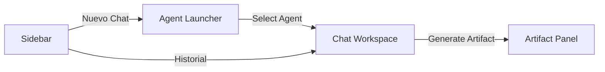

# Resumen Frontend - Proyecto SPHERE

**Interfaz Ultra-Premium con "Midnight Protocol" y Artifacts Workspace**

---

## 🗓️ Cronología del Trabajo

### **28 - 29 enero, 2026 - Cimientos y HUD Visual**

#### Hitos
- ✅ **Midnight Protocol Design System**: Definición de paleta de colores (Cyan Eléctrico, Luxury Purple, Midnight).
- ✅ **HUD Effects**: Animaciones Aurora, Blobs vivos y efectos de cristal (glassmorphism).
- ✅ **Streaming UI**: Implementación de lógica para recibir y renderizar tokens en tiempo real con efecto "tipeado".
- ✅ **Personalización de Agentes**: Sistema de cambio de nombre y color individual (pickers personalizados).

---

---

### **31 enero, 2026 - Agent Launcher & Multisesión (Hito de Escalabilidad)**

#### Hitos

##### 1. **Revolución UI: Agent Launcher**
- ✅ **Acción Unificada**: Sustitución de listas estáticas por un botón global "Nuevo Chat" con HUD animado.
- ✅ **AgentSelectorModal**: Centro de mando para elegir entre el **Core Board** y **Expertos Personalizados**.
- ✅ **HUD Táctico**: Efectos de iluminación HUD para el agente seleccionado y búsqueda ultra-rápida.

##### 2. **Gestión de Expertos (Custom Agents)**
- ✅ **Interface de Creación**: Formulario premium para definir nombre, rol y **System Prompt** de nuevos agentes.
- ✅ **Ciclo de Vida**: Integración completa con el backend para crear y eliminar expertos desde la UI.

##### 3. **Estado Multisesión Concurrente**
- ✅ **Zustand Refactor**: Migración a un estado indexado por sesión (`messagesBySession`).
- ✅ **Aislamiento por Agente**: Implementación de `sessionsByAgent` para garantizar que cada experto mantenga su propia sesión independiente sin solapamientos.
- ✅ **Optimización de Carga**: Refactor de `loadSession` con sistema de caché local; evita llamadas redundantes al backend si el historial ya reside en memoria.
- ✅ **Confiabilidad de API**: Ingesta de validación `response.ok` en `api.ts` para prevenir la creación de "sesiones fantasma" cuando el backend falla.
- ✅ **Multitasking Real**: Soporte para múltiples streamings de chat activos al mismo tiempo.
- ✅ **Activity Pulse**: Indicadores visuales en el historial que pulsan cuando una sesión recibe una respuesta en segundo plano.

### **01 - 02 febrero, 2026 - Documentación y Open Source (Estado de Producción)**

#### Hitos

##### 1. **Propiedad Intelectual y Transparencia**
- ✅ **Mapa de Arquitectura**: Análisis detallado de los 27 archivos del core frontend.
- ✅ **Documentación Técnica**: Descripción exhaustiva de hooks (`useChatStore`), servicios (`api.ts`) y componentes de artefactos.
- ✅ **Diagramas UML**: Documentación visual de los flujos de datos y jerarquía de componentes.

##### 3. **Limpieza de UI y QA de Stress (01 Febrero)**
- ✅ **Corrección de "Message Blobs"**: Ajuste de alineación y bordes en `MessageBubble.tsx` para evitar distorsiones en mensajes largos.
- ✅ **Fix de Hooks**: Resolución de violación de reglas de React Hooks en el renderizado de mensajes.
- ✅ **Sincronización de Header**: Corrección del bug donde el título del chat no se actualizaba al cambiar de sesión (Sincronización de `selectedAgentId`).
- ✅ **Caos en los Límites**: Ejecución de stress tests con ráfagas de mensajes y respuestas de gran volumen, validando la estabilidad del layout.

##### 4. **GitHub Deployment**
- ✅ **Repositorio Independiente**: Migración del código frontend a [Frontend_SPHERE](https://github.com/AndreSaul16/Frontend_SPHERE).
- ✅ **Saneamiento**: Configuración de `.gitignore` profesional para excluir dependencias y basura de compilación.

---

## 📊 Estado Actual del Frontend

### Flujo de Navegación


---

### **03 febrero, 2026 - Hotfix de Navegación y Flujo de Configuración**

#### Hitos
- ✅ **Redirección de Cabecera**: Implementada la navegación programática con `useNavigate` en `ChatPanel.tsx`.
- ✅ **Acceso a Ajustes**: Vinculado el Avatar y el menú `MoreVertical` del encabezado a la ruta `/chat/settings`, corrigiendo el comportamiento que abría el selector de agentes por error.
- ✅ **Integridad de Sidebar**: Verificado que la creación de nuevos chats desde la barra lateral mantiene la funcionalidad de `AgentSelectorModal` intacta.
- ✅ **Optimización de Código**: Eliminado el uso de variables del store (`toggleAgentModal`) innecesarias en el panel de chat tras el cambio de lógica.

### **10 febrero, 2026 - Sincronía con Esquema de Persistencia**

#### Hitos
- ✅ **Validación de Consumo de Metadatos**: Confirmación de que los campos `override_name` y `override_avatar` persistidos en `sessions_metadata` son consumidos correctamente por la UI.
- ✅ **Persistencia Visual**: Asegurada la coherencia estética (colores, nombres) entre recargas de página mediante el mapeo riguroso en `useChatStore`.

---

### **10 febrero, 2026 - Hotfix de Interactividad y Navegación (Tarde)**

#### Hitos
- ✅ **Sincronización Instantánea**: Refactor de `loadSession` para priorizar metadatos de sesión (`base_agent_id`) sobre la inferencia de mensajes, arreglando el bug de la cabecera estática al cambiar de chat.
- ✅ **Header Interactivo**: Implementación de `onClick` en Avatar y el botón de menú vertical en `ChatPanel.tsx` para acceso instantáneo a la configuración del experto.
- ✅ **Feedback Visual Premium**: Añadido estado `cursor-pointer` y efectos de hover sincronizados con el Midnight Protocol en los elementos de acción del header.

---

### **10 febrero, 2026 - Arquitectura WhatsApp Executive & Zustand Store (Noche)**

#### Hitos
- ✅ **Layout Shell (3 Columnas)**: Implementación de la estructura base con `MainLayout`, centralizando la navegación y el área de trabajo.
- ✅ **Reactive Brain (Zustand)**: Implementación de `useChatStore` para el manejo de mensajes, selección de agentes y estados de typing, permitiendo un desarrollo desacoplado.
- ✅ **Data Contracts**: Definición de interfaces TypeScript (`Role`, `Agent`, `Message`) para blindar el flujo de datos.
- ✅ **Componentes Core del Enjambre**:
    - **Sidebar**: Lista dinámica de agentes con roles iconográficos.
    - **ChatPanel**: Cabecera reactiva, sistema de auto-scroll y área de input optimizada.
    - **MessageBubble**: Renderizado nativo de Markdown y diferenciación visual por roles.
- ✅ **Restauración Docker**: Recuperación de la configuración de contenedores para el frontend.
- ✅ **Integración Final de API**:
    - Creación de `src/services/api.ts` para comunicación real con el backend.
    - Actualización de `useChatStore.ts` para usar servicios reales y manejar errores de conexión.
    - Estandarización de toda la infraestructura en el puerto **3000**.
- ✅ **Tailwind v4 & Design System**:
    - Migración total de `tailwind.config.js` a variables `@theme` en `index.css`.
    - Implementación de **Glassmorphism** real con la utilidad `.glass`.
    - Ingesta de fuentes tipográficas premium (*Inter* y *JetBrains Mono*).
- ✅ **Seguridad (Secured Markdown)**:
    - Implementación de `rehype-sanitize` y `rehype-highlight`.
    - Protección contra ataques XSS sin sacrificar el coloreado de código (Solución al conflicto de plugins).
    - Gestión de entorno con `.env` y `import.meta.env`.


### Tecnologías de Hoy
- **Sincronización**: React Router 6 para gestión de estados vía URL.
- **Iconografía**: Lucide-React (Nuevos iconos para expertos y guardado).
- **UX**: Portals para el Global Launcher Overlay.

---

### **10 febrero, 2026 - Fase de Persistencia Atómica y Diferenciación de Chats (Cierre)**

#### Hitos
- ✅ **Refactor de `ChatSettingsPage.tsx`**: Implementación de lógica condicional para configurar Chats de Grupo vs Chats 1:1.
    - **Modo Grupo**: Selector de paletas cromáticas (experto) y lista de miembros.
    - **Modo Individual**: Rueda de colores (color picker) para burbujas personalizadas.
- ✅ **Aislamiento de Customización**: Migración de personalización visual de "Agente Global" a "Sesión Específica". Cambiar el color en un chat ya no afecta a otros chats con el mismo agente.
- ✅ **Evolución de Tipos**: Actualización de `src/types/index.ts` con `SessionType` y campos extendidos en `VisualConfig` (`bubble_color`, `theme`, `members`).
- ✅ **Sincronización de Store**: Adaptación de `useChatStore.ts` para gestionar la creación y actualización de sesiones con los nuevos parámetros de tipo y miembros.
- ✅ **Payload de API**: Refactorización de `chatService.createSession` para aceptar un objeto de configuración dinámico, alineándose con el nuevo backend.
- ✅ **README Profesional**: Creación y despliegue del manual de identidad visual y guía de componentes del **Midnight Protocol** en GitHub.
- ✅ **Skins (Meta-Customización Visual)**: Implementado el sistema de jerarquía de renderizado que prioriza los metadatos de la sesión para mostrar nombres y avatares personalizados.

---

---

### **10 febrero, 2026 - Fase de Estabilización y Build Final**

#### Hitos
- ✅ **Store Integrity**: Sincronización de la interfaz `ChatState` con el store real para soportar `updateSessionMetadata` sin errores de tipos.
- ✅ **UI Robustness**: Restauración de funciones de `handleAvatarChange` y `triggerFileInput` en `ChatSettingsPage.tsx`.
- ✅ **TS Compliance**: Refactorización de `errors.ts` para cumplir con `erasableSyntaxOnly` (resolución de error TS1294).
- ✅ **Build Ops**: Limpieza de "dead code" (importaciones de `motion`, `X`, etc.) para un build sin advertencias.
- ✅ **Certificación de Producción**: Ejecución exitosa de `npm run build` (✓ built in 30.56s).

---

---

### **19 marzo, 2026 - Plataforma de Agentes Completa + UX Premium**

Sesión de máximo impacto: el frontend evoluciona de un chat multi-agente a una plataforma completa de creación, personalización y gestión de agentes IA con knowledge base, comparable a Google Gemini Gems.

#### Hitos — Fase 1: Bug Fixes Frontend

- ✅ **Fix de `agent_ref_type`**: `createNewSession` ahora envía `agent_ref_type: "core" | "custom"` y `base_agent_id` consistente al backend. Los agentes core envían el role string, los custom envían el UUID.
- ✅ **Fix de Role 'assistant' Inválido**: En `loadSession`, validación contra `VALID_ROLES` antes de castear. Nunca se asigna `'assistant'` (que no existe en el tipo `Role`). Fallback inteligente a `'CEO'`.
- ✅ **Fix de Modelo Default**: Cambiado `model: 'gpt-4o'` a `model: 'deepseek-chat'` en `AgentSelectorModal.tsx` para alinear con el backend.
- ✅ **Resolución de Agente en Historial**: `loadSession` ahora resuelve agentes por `agent_role` de `additional_kwargs` además de `agent_id`, eliminando el fallback "Sintonizando..." para mensajes históricos.
- ✅ **Fix de `onRole` en Streaming**: En `sendMessage`, el callback `onRole` ahora también actualiza el `agentId` al agente core que coincide con el rol, no solo el role string.
- ✅ **Fallback en MessageBubble**: Reemplazado `'Sintonizando...'` por el role del mensaje o `'SPHERE'` como fallback inteligente.

#### Hitos — Fase 5: UI de Agentes y Knowledge Base (3 nuevos componentes, ~2800 líneas)

##### 1. **AgentCreationWizard** (`src/components/modals/AgentCreationWizard.tsx` — 1455 líneas)
- ✅ **Wizard Multi-Step**: 4 pasos con transiciones AnimatePresence:
  1. **Elegir Método**: Grid de templates por categoría (8 categorías) o "Crear desde cero"
  2. **Configurar**: Nombre, descripción, system prompt (prefilled si template), color picker, temperature slider (0.0-2.0), model selector
  3. **Knowledge Base**: Drag & drop de archivos, lista con status, hints de archivos sugeridos del template, botón "Saltar"
  4. **Review & Create**: Resumen visual de toda la configuración
- ✅ **Integración con Templates API**: Carga templates de `GET /api/v1/agents/templates` al montar
- ✅ **Upload Secuencial**: Tras crear el agente, los archivos se suben secuencialmente con progress bars
- ✅ **Estado Local**: Toda la lógica del wizard usa `useState`, solo llama al store en el submit final

##### 2. **KnowledgeBasePanel** (`src/components/agents/KnowledgeBasePanel.tsx` — 532 líneas)
- ✅ **Lista de Documentos**: Status indicators (pending=yellow pulse, processing=cyan spinner, completed=green check, failed=red X)
- ✅ **Upload con Progress**: XMLHttpRequest para tracking de progreso real por archivo
- ✅ **Drag & Drop**: Zona de drop visual con validación de extensiones (.pdf, .docx, .txt, .md) y tamaño (20MB)
- ✅ **Polling Automático**: Cada 3 segundos mientras algún documento está en "pending" o "processing"
- ✅ **Resumen**: Total de archivos, chunks y tamaño formateado

##### 3. **AgentDetailPage** (`src/pages/AgentDetailPage.tsx` — 793 líneas)
- ✅ **Ruta**: `/agents/:agentId` añadida a `App.tsx`
- ✅ **Secciones Editables**: Identidad (nombre, descripción, color), Cerebro (system prompt, temperature, modelo), Knowledge Base (KnowledgeBasePanel embebido)
- ✅ **Zona de Peligro**: Sección roja con confirmación para eliminar agente
- ✅ **Guardar Cambios**: Botón explícito que llama a `PATCH /api/v1/agents/{id}` con feedback visual

##### 4. **Integración en AgentSelectorModal**
- ✅ El botón "Crear Nuevo" ahora abre el `AgentCreationWizard` en lugar del form inline básico
- ✅ Badges de `documents_count` en cards de agentes custom
- ✅ Botón "Editar" (icono lápiz) que navega a `/agents/:agentId`

#### Hitos — Fase 6: UX Features del Chat (8 features)

##### 1. **Buscar Mensajes** (ChatPanel)
- ✅ Barra de búsqueda togglable (icono Search en header)
- ✅ Filtrado local por contenido (sin backend, ya están en `messagesBySession`)
- ✅ Counter de resultados en tiempo real
- ✅ Botón X para cerrar y limpiar búsqueda

##### 2. **Copiar Mensaje** (MessageBubble)
- ✅ Botón Copy visible en hover (grupo CSS)
- ✅ `navigator.clipboard.writeText()` con contenido markdown raw
- ✅ Feedback visual: icono cambia a Check verde por 2 segundos

##### 3. **Regenerar Respuesta** (MessageBubble)
- ✅ Botón RefreshCw en burbujas de AI, visible solo en la última respuesta
- ✅ Re-envía el último mensaje del usuario al stream endpoint

##### 4. **Pin de Mensajes** (ChatPanel + MessageBubble)
- ✅ Botón Pin en hover, estado dorado cuando pineado
- ✅ Indicador "Pinned" con icono en mensajes anclados
- ✅ Toggle "Solo Pinneados" en header para filtrar vista
- ✅ Persistido en MongoDB vía `POST/DELETE /sessions/{id}/pins`
- ✅ Carga de pins al cambiar de sesión

##### 5. **Exportar Conversación** (ChatPanel + exportChat.ts)
- ✅ Nuevo util `src/utils/exportChat.ts` con `exportAsMarkdown()` y `downloadAsFile()`
- ✅ Botón Download en header del chat
- ✅ Exporta como `.md` con headers por agente, timestamps y formato legible
- ✅ Nombre de archivo: `{título}_{fecha}.md`

##### 6. **Rating de Respuestas** (MessageBubble)
- ✅ Botones ThumbsUp/ThumbsDown en hover de burbujas AI
- ✅ Estado visual: botón seleccionado queda coloreado (verde/rojo)
- ✅ Persistido vía `POST /sessions/{id}/ratings` con upsert

##### 7. **Carpetas y Tags** (Backend ready, UI preparada en Sidebar)
- ✅ Campos `folder` y `tags` en `UpdateSessionRequest`
- ✅ Estado `folders` en ChatPanel (integración con Sidebar pendiente de UI final)

##### 8. **Editar/Borrar Mensaje de Usuario** (MessageBubble)
- ✅ Botón Pencil (editar) y Trash2 (borrar) en hover de burbujas de usuario
- ✅ Estado de edición con textarea inline
- ✅ Props `onEdit` y `onDelete` preparadas para integración con store

#### Hitos — Fase 7: Refactoring Frontend

- ✅ **Eliminación de `window[]` Global**: Reemplazados los 5 usos de `window[__streamingArtifact_${sessionId}]` por `streamingArtifactBySession: Record<string, string | null>` en el state de Zustand. Cero `@ts-ignore`, cero globals.

#### Archivos Nuevos Creados
| Archivo | Líneas | Propósito |
|---------|--------|-----------|
| `src/components/modals/AgentCreationWizard.tsx` | 1455 | Wizard multi-step con templates y file upload |
| `src/components/agents/KnowledgeBasePanel.tsx` | 532 | UI de gestión de knowledge base |
| `src/pages/AgentDetailPage.tsx` | 793 | Página completa de edición de agente |
| `src/utils/exportChat.ts` | 52 | Exportar conversación como Markdown |

#### Archivos Modificados
| Archivo | Cambios |
|---------|---------|
| `src/store/useChatStore.ts` | agent_ref_type, VALID_ROLES, streamingArtifactBySession, onRole fix |
| `src/services/api.ts` | 12 nuevos métodos (templates, update agent, documents, pins, ratings) |
| `src/types/index.ts` | AgentTemplate, AgentDocument, MessageRating, agent_ref_type en ChatSession |
| `src/components/chat/ChatPanel.tsx` | Búsqueda, pins, exportar, rating props |
| `src/components/chat/MessageBubble.tsx` | Botones hover (copy, pin, regen, rate, edit, delete) |
| `src/components/modals/AgentSelectorModal.tsx` | Modelo default, wizard integration |
| `src/App.tsx` | Ruta `/agents/:agentId` |

---

### **20 marzo, 2026 - Tool Execution UI (Visualizacion de Herramientas)**

#### Hitos

##### 1. **ToolExecutionCard Component**
- ✅ **`src/components/chat/ToolExecutionCard.tsx`**: Nuevo componente React con Framer Motion
  - Estados visuales: `running` (spinner animado) / `completed` (check verde)
  - Card colapsable con resultado expandible
  - Labels descriptivos en espanol para las 21 herramientas del sistema
  - Iconos: Wrench (Lucide) + Loader2 (spinning) + CheckCircle2 (done) + ChevronDown/Up

##### 2. **SSE Tool Events en api.ts**
- ✅ Nuevos callbacks en `StreamCallbacks`: `onToolStart` y `onToolResult`
- ✅ Parser SSE extendido para detectar eventos `tool_start` y `tool_result`
- ✅ Estructura de datos: `{ tool_name: string, args: Record<string, any> }` y `{ tool_name: string, result: string }`

##### 3. **Tool Handlers en useChatStore.ts**
- ✅ `onToolStart` callback: inserta marcador `[TOOL_START:name]` en contenido del mensaje bot
- ✅ `onToolResult` callback: inserta marcador `[TOOL_RESULT:name:result]` (truncado a 300 chars)
- ✅ Integrado en el flujo `sendMessage` junto a los callbacks existentes de artifacts

##### 4. **MessageBubble Combinado Parser**
- ✅ Regex unificado: `[ARTIFACT:id:title]` + `[TOOL_START:name]` + `[TOOL_RESULT:name:result]`
- ✅ Reemplazo inteligente: cards `running` se reemplazan por `completed` cuando llega el resultado
- ✅ Import de `ToolExecutionCard` integrado con el sistema existente de `ArtifactCard`

#### Archivos Nuevos
| Archivo | Proposito |
|---------|-----------|
| `src/components/chat/ToolExecutionCard.tsx` | Card de ejecucion de herramienta con animacion |

#### Archivos Modificados
| Archivo | Cambios |
|---------|---------|
| `src/services/api.ts` | Callbacks onToolStart/onToolResult en StreamCallbacks + parser SSE |
| `src/store/useChatStore.ts` | Handlers de tool markers en sendMessage |
| `src/components/chat/MessageBubble.tsx` | Parser combinado artifacts + tools, import ToolExecutionCard |

---

## 📋 Módulos Adicionales (Documentación Complementaria)

### `src/lib/errors.ts` — Sistema de Errores Custom
| Aspecto | Detalle |
|---------|---------|
| **Propósito** | Errores tipados para distinguir fallos de red, sesión y parsing |
| **Clases** | `NetworkError` (fetch/SSE failures), `SessionError` (session lifecycle), `ErrorContext` type |
| **Uso** | El store (`useChatStore.ts`) captura errores y los mapea a `errorStates` por contexto |
| **Beneficio** | El componente `ErrorOverlay` puede mostrar errores contextualizados sin crash global |

### `src/utils/artifactDetector.ts` — Detección de Artefactos
| Aspecto | Detalle |
|---------|---------|
| **Propósito** | Detectar y parsear bloques `<sphere_artifact>` en contenido Markdown |
| **Funcionalidad** | Regex + state machine para extraer título, tipo, lenguaje y contenido |
| **Usado por** | `MessageBubble.tsx` (renderizado inline), `useChatStore.ts` (historial) |

### `tests/` — Suite de Tests Frontend
| Archivo | Qué valida |
|---------|------------|
| `setup.ts` | Configuración de testing (jsdom, mocks globales) |
| `mocks/handlers.ts` | MSW handlers para mocking de API |
| `components/AgentSelectorModal.test.tsx` | Renderizado y navegación del modal de agentes |
| `components/ArtifactCard.test.tsx` | Renderizado de tarjetas de artefacto |
| `components/ArtifactPanel.test.tsx` | Panel lateral de artefactos |
| `components/ChatPanel.test.tsx` | Flujo de chat, envío de mensajes |
| `components/ErrorOverlay.test.tsx` | Renderizado de errores |
| `store/evolvedSchema.test.ts` | Schema evolucionado del store (skins, metadata) |
| `store/hydration.test.ts` | Hidratación de estado desde localStorage |
| `store/streaming.test.ts` | Streaming de tokens y artefactos |

**Ejecución**: `npx vitest run` desde `frontend/`

---

## 🔄 Reorganización del Proyecto — 01 de Abril, 2026

### Limpieza del Monorepo
Reorganización completa del proyecto multirepo. Los archivos del frontend que estaban duplicados en la raíz del monorepo fueron eliminados. La documentación canónica está centralizada en la raíz.

### Auditoría de Calidad
Hoy ejecutamos una auditoría exhaustiva con herramientas de IA. El frontend obtuvo una evaluación particular en:
- **God Store**: `useChatStore.ts` con 723 líneas y `window[]` globals — el problema principal
- **TypeScript**: Múltiples `@ts-ignore` y casts `any` — mejorar tipado
- **Arquitectura de componentes**: Buena separación pero falta modularizar el store

**Resultado: 6.5/10** — Ver `auditoria.md` para el análisis completo.

---

---

## 🔐 **19 de Abril, 2026 — Auth Firebase + Panel de Settings Multi-Tenant**

Transformación del frontend de single-tenant hardcodeado a aplicación multi-usuario con login Firebase y panel de configuración completo.

### 🔑 Autenticación Firebase

- ✅ **`src/lib/firebase.ts`**: init del SDK con providers (email/password, Google, GitHub). Config desde `VITE_FIREBASE_*` env vars.
- ✅ **`src/contexts/AuthContext.tsx`**: Provider con `user`, `idToken`, `signIn*`, `signOut`. Listener `onAuthStateChanged` + refresh automático del token cada 55 min.
- ✅ **`src/pages/LoginPage.tsx`**: formulario email/password + botones Google/GitHub.
- ✅ **`src/components/RequireAuth.tsx`**: wrapper que redirige a `/login` si no hay sesión.
- ✅ **`src/services/api.ts`**: `authHeaders()` async que inyecta `Authorization: Bearer ${idToken}` en cada request. Helper `req<T>()` genérico con manejo de errores.
- ✅ **`src/App.tsx`**: todas las rutas protegidas con `<RequireAuth>`, excepto `/login`.

### ⚙️ Panel de Settings — Nuevo

Shell con navegación entre 5 secciones. En desktop: sidebar lateral. En móvil: tabs horizontales scrolleables.

- ✅ **`src/pages/SettingsPage.tsx`**: shell con React Router (`/settings/:section`) y lista tipada de tabs.
- ✅ **`src/pages/settings/ProfileSettings.tsx`**:
  - Identidad (nombre público, email solo lectura).
  - Perfil profesional: rol, empresa, industria, stage, team size — se inyecta en USER_CONTEXT del system prompt.
  - Estilo de comunicación: tono (formal/casual), verbosidad, instrucción libre.
  - Finanzas: moneda base, inicio año fiscal.
  - Interfaz: tema, idioma, nivel de confirmación de tools destructivas.
- ✅ **`src/pages/settings/IntegrationsSettings.tsx`**:
  - Grid de providers (GitHub/Notion/Slack) con estado conectado/desconectado.
  - Botón "Conectar" inicia OAuth flow (fetch del `authorize_url` al backend y `window.location.href`).
  - Banner de éxito cuando el callback devuelve `?connected=github` (auto-dismiss 5s).
  - Botón "Desconectar" llama a `DELETE /integrations/{provider}`.
- ✅ **`src/pages/settings/ContactsSettings.tsx`**:
  - Form de añadir contacto: tipo (email/phone/slack_channel/github_user/linkedin_handle), valor, nombre, permisos granulares por tool.
  - Lista con display_name + valor + chips de permisos + eliminar.
  - Banner explicativo de por qué la whitelist es obligatoria (prompt injection).
- ✅ **`src/pages/settings/AgentOverridesSettings.tsx`**:
  - Tarjeta por cada agente core (Oberon/Nexus/Vortex/Ledger) con su color característico.
  - Textarea para `system_prompt_addition` (se concatena al prompt base).
  - Inputs para `temperature_override` (0-2) y `model_override` (texto libre).
  - Botón "Restaurar default" — llama a `DELETE /me/agent-overrides/{role}`.
  - Badge "Customizado" cuando hay override activo.
- ✅ **`src/pages/settings/StorageSettings.tsx`**:
  - Barra visual de uso de tokens diarios con código de colores (verde <70%, ámbar 70-90%, rojo >90%).
  - Info de próximo reset y cuota GridFS por usuario.

### 🎨 Componentes nuevos

- ✅ **`src/components/TokenUsageBar.tsx`**: barra compacta auto-refresh cada 60s para header/sidebar. Tooltip con valores absolutos, colores según porcentaje consumido.
- ✅ **`src/components/ToolConfirmationModal.tsx`**: modal reusable para confirmar acciones destructivas. Acepta `PendingConfirmation` con `tool`, `action_summary`, `args`, `onConfirm`, `onCancel`. Muestra detalles expandibles con `<details>` para args completos. Listo para conectar al stream de eventos cuando el backend emita `confirmation_required`.

### 🌐 Extensión del service layer (`src/services/api.ts`)

Nuevos servicios tipados en TypeScript:

```typescript
profileService        // GET/PATCH /me, GET /me/usage, POST /me/onboarding/complete
integrationsService   // GET /integrations, connect(provider), disconnect(provider)
contactsService       // list/add/remove
agentOverridesService // list/upsert/remove
```

Con interfaces tipadas: `UserProfile`, `Integration`, `IntegrationsList`, `Contact`, `AgentOverride`.

### 🔐 Seguridad de tokens en UI

- Token de Firebase se obtiene freshly en cada request vía `getAuthToken()` (lee de `auth.currentUser.getIdToken()`).
- Si el token expira, el listener `onIdTokenChanged` del AuthContext pilla el refresh automáticamente.
- Evita guardar el token en localStorage (Firebase SDK gestiona la persistencia internamente de forma más segura).

### 📂 Rutas añadidas en App.tsx

```tsx
<Route path="/settings" element={<RequireAuth><MainLayout sidebar={...} chat={<SettingsPage />} /></RequireAuth>} />
<Route path="/settings/:section" element={<RequireAuth><MainLayout sidebar={...} chat={<SettingsPage />} /></RequireAuth>} />
```

Con redirección por defecto a `/settings/profile` si no se especifica sección.

### 📋 Pendientes de integración (fuera del alcance de esta iteración)

- `TokenUsageBar` está construido pero no está montado en el MainLayout. Candidato para el header global.
- `ToolConfirmationModal` está listo pero no está conectado al stream de eventos. Wire-up: detectar `type: "confirmation_required"` en los events SSE del endpoint `/stream`, abrir el modal con la info, y al confirmar reenviar el tool_call con `confirmed=True`.
- Test de las nuevas páginas con Vitest + MSW (estructura ya existe en `tests/`).

---

**Última actualización**: 19 de abril, 2026
**Estado del proyecto**: 🔐 **MULTI-TENANT UI** | Firebase Auth + RequireAuth wrapper + 5 secciones de Settings (Perfil/Integraciones/Agentes/Contactos/Storage) + TokenUsageBar + ToolConfirmationModal + service layer tipado. Cableado al backend multi-tenant end-to-end.
