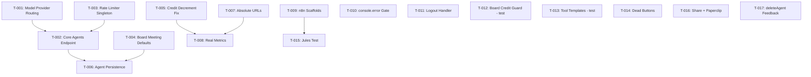

# Tasks: SPHERE Production Readiness — Re-Audit v2

> **Change**: `ragnarok-production-audit-v2`
> **Total tasks**: 17 (4 phases)
> **Delivery strategy**: `force-chained` (user selected C3)
> **Chain strategy**: `feature-branch-chain`
> **Review budget**: 800 lines

---

## Review Workload Forecast

| Metric | Value |
|--------|-------|
| Total estimated changed lines | ~843 |
| Exceeds 800-line review budget | **Yes** (843 > 800) |
| Chained PRs recommended | **Yes** |
| Number of chain PRs | **4** |
| Strategy | `feature-branch-chain` (tracker → 4 child PRs) |

### Chain Overview

```text
main
 └── feat/ragnarok-audit-v2                 ← tracker (draft, no-merge)
      ↑ PR #1 base: feat/ragnarok-audit-v2
      └── feat/ragnarok-audit-v2-01-crit    ← T-001 + T-003 (~188 lines)
           ↑ PR #2 base: feat/ragnarok-audit-v2-01-crit
           └── feat/ragnarok-audit-v2-02-core-agents  ← T-002 (~237 lines)
                ↑ PR #3 base: feat/ragnarok-audit-v2-02-core-agents
                └── feat/ragnarok-audit-v2-03-high    ← T-004..T-008 (~297 lines)
                     ↑ PR #4 base: feat/ragnarok-audit-v2-03-high
                     └── feat/ragnarok-audit-v2-04-polish  ← T-009..T-017 (~121 lines)
```

| PR | Tasks | Est. Lines | Domain |
|----|-------|-----------|--------|
| PR #1 | T-001, T-003 | ~188 | Backend CRITICAL (model routing + rate limiter) |
| PR #2 | T-002 | ~237 | Core agents endpoint + frontend integration |
| PR #3 | T-004..T-008 | ~297 | HIGH phase (defaults, credit, persistence, URLs, metrics) |
| PR #4 | T-009..T-017 | ~121 | MEDIUM/LOW polish |
| **Total** | **17** | **~843** | |

Each PR is ≤400 changed lines, respecting the chained-pr budget boundary.

---

## Phase 1 — CRITICAL (must-fix before any user touches platform)

### T-001 — Model Provider Registry

| Field | Value |
|-------|-------|
| **Task ID** | T-001 |
| **Phase** | 1 |
| **Domain** | `model-provider-routing` |
| **Specs** | MPR-001, MPR-002, MPR-003 |
| **Dependencies** | None |
| **Estimated lines** | ~108 |

**Description**: Create `ModelProviderRegistry` with `resolve_provider(model)` that maps model name prefix → provider config (`api_key`, `base_url`). Integrate into `agent_node()` in orchestrator and `board_classifier.py`. Replace all hardcoded `DEEPSEEK_API_KEY` / `DEEPSEEK_BASE_URL` with registry lookup in the two dynamic LLM construction sites. Module-level `llm_router` and `llm_expert` remain on DeepSeek (they use fixed `"deepseek-chat"` and routing is a separate concern).

**Files to touch**:
- `backend/app/core/model_registry.py` (**CREATE**) — `resolve_provider(model: str) -> dict`
- `backend/app/application/orchestrator.py` (lines 390–397) — replace hardcoded `openai_api_key=DEEPSEEK_API_KEY, openai_api_base=DEEPSEEK_BASE_URL` with `config = resolve_provider(resolved.model)`; pass `config["api_key"]` and `config["base_url"]`
- `backend/app/application/board_classifier.py` (lines 22–28) — replace hardcoded `classifier_llm` construction with `resolve_provider("deepseek-chat")`

**Tests required** (pytest):
1. `test_resolve_gpt_models` — parametrize `gpt-4o`, `gpt-4o-mini` → returns `OPENAI_API_KEY` + `https://api.openai.com/v1`
2. `test_resolve_deepseek_models` — parametrize `deepseek-chat`, `deepseek-r1` → returns `DEEPSEEK_API_KEY` + `DEEPSEEK_BASE_URL`
3. `test_resolve_unknown_model_graceful_fallback` — unknown model → fallback to default provider, log WARNING, no crash
4. `test_agent_node_uses_registry` — mock `resolve_provider`, verify `ChatOpenAI` receives correct kwargs from mock
5. `test_board_classifier_uses_registry` — monkeypatch `resolve_provider`, verify classifier_llm creation reads registry

**Acceptance criteria**:
- [x] `gpt-4o` requests route to OpenAI API (key + URL verified in test)
- [x] `deepseek-chat` requests route to DeepSeek API (current behavior preserved)
- [x] Unknown model name logs warning, falls back, does not crash
- [x] `board_classifier` no longer hardcodes DeepSeek credentials
- [x] Existing DeepSeek flow (default model) unchanged

---

### T-002 — Core Agents Endpoint + Frontend Integration

| Field | Value |
|-------|-------|
| **Task ID** | T-002 |
| **Phase** | 1 |
| **Domain** | `core-agents-endpoint` |
| **Specs** | CAE-001, CAE-002, CAE-003, CAE-004 |
| **Dependencies** | None (T-001 recommended for ordering but not blocking) |
| **Estimated lines** | ~237 |

**Description**: Add `GET /api/v1/agents/core` endpoint returning the 5 core agents from server-side metadata. Remove `MOCK_AGENTS` TypeScript constant. Refactor `fetchCustomAgents` → `refreshAgents` that loads core + custom agents on init. Core agents load first, then custom agents merge in. `group-chat` always first in order.

**Files to touch**:
- `backend/app/presentation/api/v1/agents.py` (+50 lines) — new `GET /agents/core` route returning 5-agent JSON array with `{id, name, role, description, capabilities, color, hexColor, isOnline, avatar}`. Names/roles from `DEFAULT_CORE_PROMPTS` mapping (group-chat→Junta Directiva, ceo-1→Oberon, etc.). Auth required (reuse `get_current_user`).
- `frontend/src/services/api.ts` (+25 lines) — export `API_URL`; add `getCoreAgents()` function that fetches `GET /agents/core`
- `frontend/src/store/useChatStore.ts` (+15 lines, -57 lines removal) — remove `MOCK_AGENTS` const (lines 63–119). Rename `fetchCustomAgents` to `refreshAgents`: calls `getCoreAgents()` + `getCustomAgents()`, sets both arrays in store. Core agents field in initial state becomes `[]`. Update all references to `fetchCustomAgents` to `refreshAgents`. Add `coreAgentsLoaded` flag to prevent double-load.

**Tests required**:
- **pytest** (`tests/test_agents_core.py`):
  1. `test_get_core_agents_returns_5` — authenticate, call endpoint, assert `len(response.json()) == 5`
  2. `test_core_agent_fields_present` — each agent has `id`, `name`, `role`, `description`, `capabilities`, `color`, `hexColor`
  3. `test_core_agents_first_is_group_chat` — first agent has `id == "group-chat"`
  4. `test_core_agents_unauthenticated_returns_401` — no Bearer token → 401
- **vitest** (`frontend/src/store/__tests__/useChatStore.test.ts`):
  1. `test_refreshAgents_loads_core_and_custom` — mock both fetch calls, call `refreshAgents`, assert `getAgents()` contains 5 core + N custom
  2. `test_core_agents_load_from_api_not_mock` — verify no `MOCK_AGENTS` reference remains; verify `getCoreAgents` mock is called
  3. `test_group_chat_first_in_order` — verify first agent.id is `group-chat`

**Acceptance criteria**:
- [x] `MOCK_AGENTS` const fully removed from codebase (no imports, no references)
- [x] Core agents load from `GET /api/v1/agents/core` on store init
- [x] `getAgents()` returns core + custom merged
- [x] Unauthenticated requests to `/agents/core` return 401
- [x] Agent ordering matches previous MOCK_AGENTS (group-chat first)

---

### T-003 — Rate Limiter Singleton

| Field | Value |
|-------|-------|
| **Task ID** | T-003 |
| **Phase** | 1 |
| **Domain** | `rate-limiting` |
| **Specs** | RL-001, RL-002, RL-003, RL-004 |
| **Dependencies** | None |
| **Estimated lines** | ~80 |

**Description**: Replace per-request `Limiter(rate)` instantiation in `stream.py` and `main.py` with a module-level lazy-init singleton `_rate_limiters: Dict[str, Limiter]`. The key is `{plan_id}:{user_id}` or `plan_id` (design says per-plan). Use `try_acquire(user_id)` which the Limiter class already supports. TTL cleanup: entries expire after `seconds * 2`.

**Files to touch**:
- `backend/app/presentation/api/v1/stream.py` (lines 355–377) — remove `limiter = Limiter(rate)` from handler body; add module-level `_rate_limiters: Dict[str, Limiter] = {}` with `_get_or_create_limiter(plan_id, times, seconds)` helper; call `_get_or_create_limiter(...).try_acquire(user_id, blocking=False)`
- `backend/main.py` (lines 340–355) — same singleton pattern inside `_optional_rate_limiter`'s `_dep` closure

**Tests required** (pytest):
1. `test_singleton_same_instance_two_requests` — get limiter twice with same plan_id, assert `is` identity
2. `test_counter_accumulates_between_calls` — acquire once, assert `limiter._get_current_volume(user_id) == 1`; acquire again, assert `2`
3. `test_rate_limit_rejects_at_threshold` — acquire up to threshold, assert next call returns False (exceeds)
4. `test_different_plans_independent_counters` — free plan and pro plan have separate limiters
5. `test_ttl_expiry_removes_entry` — mock time forward past window, assert counter resets

**Acceptance criteria**:
- [x] Same limiter instance reused across requests (module-level singleton)
- [x] Counter accumulates between requests for same plan
- [x] Per-plan thresholds enforced (free: 10/60s, starter: 30/60s, premium: 60/60s)
- [x] Threshold exceeded → 429 with `Retry-After` header
- [x] No memory leak (TTL-expired entries cleaned up)

---

## Phase 2 — HIGH (must-fix before public launch)

### T-004 — Board Meeting Default ON

| Field | Value |
|-------|-------|
| **Task ID** | T-004 |
| **Phase** | 2 |
| **Domain** | `credit-system` |
| **Specs** | CS-006 |
| **Dependencies** | None |
| **Estimated lines** | ~33 |

**Description**: Add `board_meeting_enabled: True` and `board_iterations: 1` to the `new_user` dict in `_auto_provision_user()` so new users get board meeting enabled by default. Uses `$setOnInsert` so existing users are unaffected.

**Files to touch**:
- `backend/app/core/auth.py` (lines 243–295) — add `"board_meeting_enabled": True` and `"board_iterations": 1` to `new_user` dict (before `$setOnInsert`)

**Tests required** (pytest):
1. `test_new_user_has_board_meeting_enabled` — mock MongoDB insert, call `_auto_provision_user`, assert `new_user["board_meeting_enabled"] is True`
2. `test_new_user_has_board_iterations_1` — assert `new_user["board_iterations"] == 1`
3. `test_existing_user_not_affected` — mock DuplicateKey → existing user path, verify existing user doc unchanged

**Acceptance criteria**:
- [x] New users created with `board_meeting_enabled: True`
- [x] New users created with `board_iterations: 1`
- [x] Existing users' board meeting setting unchanged
- [x] `$setOnInsert` correctly applies only on insert

---

### T-005 — Single Credit Decrement Fix

| Field | Value |
|-------|-------|
| **Task ID** | T-005 |
| **Phase** | 2 |
| **Domain** | `credit-system` |
| **Specs** | CS-004 |
| **Dependencies** | None |
| **Estimated lines** | ~28 |

**Description**: Remove the duplicate `useBillingStore.getState().decrementOptimistic()` call from `ChatPanel.tsx:144`. The single decrement in `api.ts` (lines 87–88) inside `streamChat()` is the authoritative one.

**Files to touch**:
- `frontend/src/components/chat/ChatPanel.tsx` (line 144) — delete `useBillingStore.getState().decrementOptimistic();` from `handleSendMessage()`. Remove unused `useBillingStore` import if not used elsewhere in file.

**Tests required** (vitest):
1. `test_single_decrement_per_send` — simulate `handleSendMessage` → assert `decrementOptimistic` called exactly once (from `api.ts` stream path, not from ChatPanel)

**Acceptance criteria**:
- [x] `decrementOptimistic()` removed from `ChatPanel.tsx`
- [x] Single credit decrement per message send
- [x] No double-charging regression
- [x] Unused import cleaned up

---

### T-006 — Agent Rename/Color Persistence

| Field | Value |
|-------|-------|
| **Task ID** | T-006 |
| **Phase** | 2 |
| **Domain** | `core-agents-endpoint` |
| **Specs** | CAE-005, CAE-006 |
| **Dependencies** | **T-002** (core agents endpoint must exist) |
| **Estimated lines** | ~160 |

**Description**: Add `PATCH /api/v1/agents/core/{agent_id}` endpoint that persists user-specific overrides for core agent name and color. Store overrides in user document `agent_overrides: {agent_id: {name?, color?}}` subfield. Frontend: make `renameAgent`/`updateAgentColor` async — call API, update store on success. Overrides merge with server defaults on GET `/agents/core`.

**Files to touch**:
- `backend/app/presentation/api/v1/agents.py` (+50 lines) — new `PATCH /agents/core/{agent_id}` route. Validates `agent_id` is one of 5 core IDs. Accepts `{name?: string, color?: string}`. Reads current user doc, updates `agent_overrides.{agent_id}` subfield via `$set`. Also modify `GET /agents/core` (from T-002) to merge `agent_overrides` into returned agents (override name/color from user doc).
- `frontend/src/services/api.ts` (+20 lines) — add `updateCoreAgent(agentId, data)` function: `PATCH /agents/core/{agentId}` with `{name, color}` body
- `frontend/src/store/useChatStore.ts` (~20 lines) — refactor `renameAgent`: make async, call `chatService.updateCoreAgent(id, {name: newName})`, then update local state on success. Same for `updateAgentColor`: async, call `chatService.updateCoreAgent(id, {hexColor: newHexColor})`. Add error handling (set `errorStates` on failure).

**Tests required**:
- **pytest**:
  1. `test_patch_core_agent_rename_persisted` — PATCH rename CEO, verify `agent_overrides.ceo-1.name` in user doc
  2. `test_patch_core_agent_color_persisted` — PATCH color, verify subfield
  3. `test_get_core_agents_returns_overrides` — PATCH rename → GET /core → returned agent has overridden name
  4. `test_patch_invalid_agent_id_404` — PATCH nonexistent agent → 404
  5. `test_patch_unauthenticated_401` — no token → 401
- **vitest**:
  1. `test_renameAgent_calls_api_and_updates_store` — spy on `updateCoreAgent`, call `renameAgent`, assert API called + coreAgents updated
  2. `test_updateAgentColor_calls_api_and_updates_store` — same for color
  3. `test_rename_survives_refresh` — mock `updateCoreAgent` → mock `refreshAgents` on reload → verify overridden name loaded

**Acceptance criteria**:
- [x] Renamed agent shows new name after page refresh
- [x] Color-changed agent shows new color after page refresh
- [x] Overrides stored per-user (two different users have different overrides)
- [x] Invalid agent ID returns 404
- [x] Unauthenticated PATCH returns 401

---

### T-007 — Absolute API URLs in Service Credentials

| Field | Value |
|-------|-------|
| **Task ID** | T-007 |
| **Phase** | 2 |
| **Domain** | `settings-page` |
| **Specs** | SP-002 |
| **Dependencies** | None |
| **Estimated lines** | ~31 |

**Description**: All 4 `fetch()` calls in `ServiceCredentialsSettings.tsx` use relative paths (`"/api/v1/..."`) which work in dev (Vite proxy) but break in production. Import `API_URL` from config and prefix all URLs.

**Files to touch**:
- `frontend/src/services/api.ts` (line 1) — `export const API_URL` (currently `const API_URL`, add `export`)
- `frontend/src/pages/settings/ServiceCredentialsSettings.tsx` (lines 72, 102, 133, 152) — import `{ API_URL }` from `"@/services/api"`; prefix all 4 fetch URL strings with `${API_URL}`. Line 72: load. Line 102: handleSave POST. Line 133: handleDelete DELETE. Line 152: handleTest POST.

**Tests required** (vitest):
1. `test_fetch_urls_prefixed_with_api_url` — mock `import.meta.env.VITE_API_URL = "https://api.sphere.ai"`, call `load()`, assert fetch called with `https://api.sphere.ai/api/v1/me/service-credentials`
2. `test_save_url_prefixed` — same for POST
3. `test_delete_url_prefixed` — same for DELETE
4. `test_test_url_prefixed` — same for test POST

**Acceptance criteria**:
- [x] All 4 fetch URLs start with `${API_URL}` not `"/api/..."`
- [x] `API_URL` exported from `api.ts`
- [x] Service credentials page works in production without Vite proxy
- [x] Backward compatible (dev mode still works via full URL or localhost fallback)

---

### T-008 — Real Latency/Token Metrics

| Field | Value |
|-------|-------|
| **Task ID** | T-008 |
| **Phase** | 2 |
| **Domain** | `credit-system` |
| **Specs** | CS-007 |
| **Dependencies** | None |
| **Estimated lines** | ~45 |

**Description**: Replace hardcoded `"Latencia: 24ms"` and `"Tokens: 0.8k/min"` in ChatPanel.tsx with dynamic measurements using `useRef`. Track time-to-first-token (TTFT) and total token count from the SSE stream callbacks (`onToken` increments token counter; `useRef` captures start time on first token). If stream hasn't started or measurement not available, hide the metrics row entirely.

**Files to touch**:
- `frontend/src/components/chat/ChatPanel.tsx` (lines 469–470) — add `useRef<number>(0)` for latency and `useRef<number>(0)` for token count. In `onToken` callback: if first token, record `Date.now() - sendStartTime`. Increment token counter. Replace hardcoded spans with `{latencyRef.current > 0 ? formatMs(latencyRef.current) : null}` and `{tokenCountRef.current > 0 ? formatTokens(tokenCountRef.current) : null}`. If both measurements are 0, hide the entire metrics row.

**Tests required** (vitest):
1. `test_metrics_hidden_when_no_data` — render ChatPanel, no stream active → assert no "Latencia" or "Tokens" text
2. `test_latency_displayed_after_first_token` — simulate onToken callback, assert latency value displayed
3. `test_token_count_increments` — simulate 5 onToken calls, assert "5" or appropriate format displayed
4. `test_no_hardcoded_24ms_or_0_8k` — assert no literal "24ms" or "0.8k/min" in rendered output

**Acceptance criteria**:
- [x] No hardcoded `"24ms"` or `"0.8k/min"` strings in ChatPanel
- [x] Real latency displayed when measurable
- [x] Token count displayed when measurable
- [x] Metrics hidden when no stream data available
- [x] No misleading fake metrics shown to users

---

## Phase 3 — MEDIUM

### T-009 — n8n Workflow Scaffolds

| Field | Value |
|-------|-------|
| **Task ID** | T-009 |
| **Phase** | 3 |
| **Domain** | `n8n` (internal) |
| **Specs** | — |
| **Dependencies** | None |
| **Estimated lines** | ~6 |

**Description**: Create the `backend/n8n/workflows/` directory referenced by `n8n_deployer.py:24`. Add `.gitkeep` and a code comment documenting the expected workflow JSON structure. Update `n8n_deployer.py` to use `Path`-relative directory resolution instead of bare string if needed.

**Files to touch**:
- `backend/n8n/workflows/.gitkeep` (**CREATE**) — empty file to preserve directory in git
- `backend/app/infrastructure/n8n_deployer.py` (line 24) — verify `WORKFLOW_DIR` resolves correctly; add docstring comment about workflow file naming convention

**Tests required**: None (infrastructure scaffolding, verified by directory existence post-deploy)

**Acceptance criteria**:
- [x] `backend/n8n/workflows/` directory exists in repo
- [x] Directory tracked by git (`.gitkeep` present)
- [x] `n8n_deployer.py` path resolution works in both dev and production

---

### T-010 — console.error DEV Gating

| Field | Value |
|-------|-------|
| **Task ID** | T-010 |
| **Phase** | 3 |
| **Domain** | Frontend hygiene |
| **Specs** | — |
| **Dependencies** | None |
| **Estimated lines** | ~24 |

**Description**: Wrap all 12 production `console.error()` calls (6 files) in `import.meta.env.DEV` checks to prevent error details from leaking in production console. Exclude test files (2 instances in test files — acceptable). Exclude `ErrorBoundary.tsx` (it already logs intentionally).

**Files to touch** (wrap each `console.error` in `if (import.meta.env.DEV)`):
- `frontend/src/pages/BillingPage.tsx` — lines 83, 90, 103, 109 (4 sites)
- `frontend/src/pages/ChatSettingsPage.tsx` — lines 71, 170, 193 (3 sites)
- `frontend/src/components/sidebar/Sidebar.tsx` — line 68 (1 site)
- `frontend/src/components/artifacts/MermaidDiagram.tsx` — line 46 (1 site)
- `frontend/src/components/agents/KnowledgeBasePanel.tsx` — line 250 (1 site)

**Tests required**: None (lint-level change, verified by grep for unwrapped `console.error` in `src/` excluding test files)

**Acceptance criteria**:
- [x] No bare `console.error()` in production frontend code (excluding test files and ErrorBoundary)
- [x] Error messages still visible in dev mode
- [x] No functional behavior change

---

### T-011 — Logout Button Handler

| Field | Value |
|-------|-------|
| **Task ID** | T-011 |
| **Phase** | 3 |
| **Domain** | Frontend UX |
| **Specs** | — |
| **Dependencies** | None |
| **Estimated lines** | ~10 |

**Description**: Wire the "Logout Protocol" button in ProfilePage (Danger Zone section) to Firebase `signOut()` + store `resetState()`. Currently has no `onClick` handler — dead UI element.

**Files to touch**:
- `frontend/src/pages/ProfilePage.tsx` (line 188) — add `onClick` handler to Logout button. Handler: `getAuth().signOut()` then `useChatStore.getState().resetState()`. Import `getAuth` from `firebase/auth`.

**Tests required**:
- **vitest**: `test_logout_button_calls_signout_and_reset` — mock `getAuth().signOut` and store `resetState`, click button, assert both called

**Acceptance criteria**:
- [x] Clicking "Logout Protocol" signs user out via Firebase
- [x] Store state reset after signout
- [x] Button no longer dead/non-functional

---

## Phase 4 — LOW

### T-012 — Board Meeting Credit Guard (Test-Only Verification)

| Field | Value |
|-------|-------|
| **Task ID** | T-012 |
| **Phase** | 4 |
| **Domain** | `credit-system` |
| **Specs** | CS-005 |
| **Dependencies** | None |
| **Estimated lines** | ~20 |

**Description**: Add regression test confirming board meeting credit flow (`already_charged=True`) skips per-agent credit charges. MED-09 was verified WORKING in explore — this task ensures it stays working.

**Files to touch**:
- `backend/tests/test_orchestrator_credit.py` (**CREATE** or extend existing) — test that when `already_charged=True`, `agent_node()` does not call `credit_manager.charge()`

**Tests required** (pytest):
1. `test_board_mode_skips_agent_charge` — call `agent_node` with `board_mode=True` / `already_charged=True`, assert credit manager charge was NOT invoked

**Acceptance criteria**:
- [x] Regression test exists and passes
- [x] Board meeting flow does not double-charge credits per agent

---

### T-013 — Tool Template Alignment (Test-Only Verification)

| Field | Value |
|-------|-------|
| **Task ID** | T-013 |
| **Phase** | 4 |
| **Domain** | Orchestrator |
| **Specs** | — |
| **Dependencies** | None |
| **Estimated lines** | ~20 |

**Description**: Add regression test confirming `load_all_tools()` runs before `agent_node()` access. MED-10 was verified WORKING — ensure tool registration order stays correct.

**Files to touch**:
- `backend/tests/test_tool_registration.py` (**CREATE** or extend existing) — test that tools are loaded before agent graph execution

**Tests required** (pytest):
1. `test_tools_loaded_before_agent_node` — simulate lifespan flow, verify tools list is populated before agent_node runs

**Acceptance criteria**:
- [x] Regression test exists and passes
- [x] Tool registration order verified correct

---

### T-014 — ProfilePage Dead Buttons Cleanup

| Field | Value |
|-------|-------|
| **Task ID** | T-014 |
| **Phase** | 4 |
| **Domain** | Frontend UX |
| **Specs** | — |
| **Dependencies** | None |
| **Estimated lines** | ~15 |

**Description**: "Cambiar Protocolo de Acceso" and "Generar Nueva API Key" buttons in ProfilePage have no onClick handlers (LOW-08). Add disabled state with tooltip or remove them entirely since they're not yet implemented. Simplest fix: add `disabled` + `title="Próximamente"` tooltip.

**Files to touch**:
- `frontend/src/pages/ProfilePage.tsx` (lines 148–155) — add `disabled` attribute to both buttons; add `title="Disponible próximamente"` for UX feedback

**Tests required**: None (visual/UX verification)

**Acceptance criteria**:
- [x] Buttons are disabled (not clickable dead elements)
- [x] Visual indication that feature is coming soon (tooltip or label)
- [x] No console errors when clicked

---

### T-015 — Jules Test Implementation

| Field | Value |
|-------|-------|
| **Task ID** | T-015 |
| **Phase** | 4 |
| **Domain** | Backend API |
| **Specs** | — |
| **Dependencies** | T-009 (n8n workflow scaffolds provide deployment target) |
| **Estimated lines** | ~15 |

**Description**: Harden the Jules service credential test stub. Currently returns `{success: True, message: "API key almacenada (test no disponible aún)"}` unconditionally (LOW-05). Add a `stub=True` parameter to `create_jules_task` in `jules_tool.py` and make the test endpoint attempt the actual n8n webhook call, falling back to the stub message on failure.

**Files to touch**:
- `backend/app/presentation/api/v1/auth.py` (lines 504–509) — attempt n8n webhook call for Jules test; if HTTP fails, return existing stub message with `success: False` to be honest about unavailability
- `backend/app/infrastructure/tools/jules_tool.py` — add `stub: bool = False` parameter; when `stub=False`, attempt live n8n call

**Tests required**:
- **pytest**: `test_jules_test_returns_honest_result` — when n8n unavailable, returns `success: False` with clear message

**Acceptance criteria**:
- [x] Jules test no longer returns false `success: True` when unavailable
- [x] Stub mode available for environments without n8n
- [x] Error message is clear about unavailability

---

### T-016 — Share Button + Paperclip Cleanup

| Field | Value |
|-------|-------|
| **Task ID** | T-016 |
| **Phase** | 4 |
| **Domain** | Frontend UX |
| **Specs** | — |
| **Dependencies** | None |
| **Estimated lines** | ~6 |

**Description**: Remove or properly implement two dead UI elements: (1) Share button placeholder in Sidebar (LOW-09), (2) Paperclip button always disabled in ChatPanel (LOW-10). Simplest: hide paperclip button entirely (no attachment feature yet); add `disabled` + tooltip to share button.

**Files to touch**:
- `frontend/src/components/sidebar/Sidebar.tsx` (lines 211–217) — add `disabled` attribute to Share button, tooltip "Compartir sesión (próximamente)"
- `frontend/src/components/chat/ChatPanel.tsx` (lines 426–431) — remove paperclip button (commented out or conditionally rendered with feature flag); or just hide with `hidden` class

**Tests required**: None (visual/UX verification)

**Acceptance criteria**:
- [x] Share button shows disabled state with feedback
- [x] Paperclip button hidden or removed
- [x] No visible dead/unresponsive UI elements

---

### T-017 — deleteCustomAgent Error Feedback

| Field | Value |
|-------|-------|
| **Task ID** | T-017 |
| **Phase** | 4 |
| **Domain** | Frontend store |
| **Specs** | — |
| **Dependencies** | None |
| **Estimated lines** | ~5 |

**Description**: `deleteCustomAgent` in useChatStore catches errors silently (only `console.error`). Add proper error state feedback so the user sees something happened on failure (LOW-06).

**Files to touch**:
- `frontend/src/store/useChatStore.ts` (lines 238–241) — in catch block: add `set({ errorStates: { ...get().errorStates, fetch_agents: 'Error al eliminar agente' } })`

**Tests required**:
- **vitest**: `test_delete_agent_error_sets_error_state` — mock `deleteCustomAgent` to throw, call action, assert `errorStates.fetch_agents` contains error message

**Acceptance criteria**:
- [x] Failed deletion sets visible error state
- [x] User sees feedback when deletion fails
- [x] Error state cleared on next successful action

---

## Task Dependency Graph



**Key dependency**: T-006 (Agent Persistence) requires T-002 (Core Agents Endpoint) — the PATCH route extends the GET route.

---

## Verification Checkpoints

| Phase | Checkpoint | Tasks |
|-------|-----------|-------|
| After Chain PR #1 | Backend CRITICAL fixes applied. Model switching works. Rate limiter functional. | T-001, T-003 |
| After Chain PR #2 | Core agents served from backend. MOCK_AGENTS removed. | T-002 |
| After Chain PR #3 | All HIGH issues fixed: defaults, credit, persistence, URLs, metrics. | T-004..T-008 |
| After Chain PR #4 | Remaining MEDIUM/LOW items cleaned up. All 17 tasks complete. | T-009..T-017 |
| Final | All 14 production issues from audit verified fixed. | All tasks |
